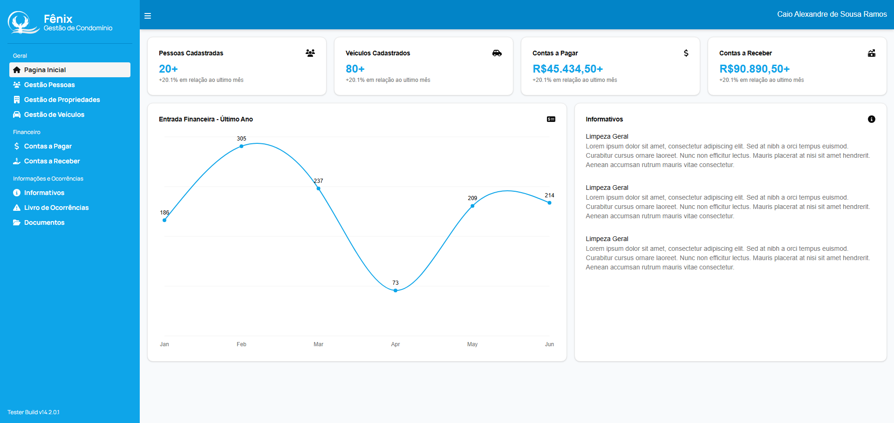

# Gestor Condomínios Web


Painel web do **Gestor de Condomínios**, criado para tornar a administração condominial mais simples, visual e eficiente. A interface reúne os principais fluxos da operação em um único lugar, permitindo que equipes administrativas consultem dados, cadastrem informações e acompanhem rotinas do condomínio com mais clareza.

O frontend foi construído com Next.js, React, TypeScript e Tailwind CSS, entregando uma experiência moderna, responsiva e preparada para crescer junto com os módulos do sistema.

## Destaques

- Interface organizada para uso administrativo diário.
- Telas para gestão de pessoas, propriedades, veículos, ocorrências e informativos.
- Módulo financeiro para contas a pagar e contas a receber.
- Integração com API PHP protegida por autenticação.
- Componentes reutilizáveis para manter consistência visual.
- Estrutura em domínio para facilitar manutenção e evolução do produto.

## Funcionalidades

- Login
- Gestão de pessoas
- Gestão de propriedades
- Gestão de veículos
- Contas a pagar
- Contas a receber
- Informativos
- Ocorrências

## Preview do sistema

### Dashboard



### Gestão de Pessoas


### Gestão de Propriedades


## Requisitos

- Node.js 20+
- npm
- API rodando em `http://localhost:8080`

## Instalação

Instale as dependências:

```powershell
npm install
```

Rode o servidor de desenvolvimento:

```powershell
npm run dev
```

Acesse:

```text
http://localhost:3000
```

## Backend/API

O frontend consome a API PHP em:

```text
http://localhost:8080/api
```

Antes de usar o painel, suba o backend na pasta `gestao-condominio-api`:

```powershell
docker compose up --build -d
docker compose exec php composer install
docker compose exec php vendor/bin/doctrine-migrations migrate --configuration=config/migrations.php --db-configuration=config/migrations-db.php
docker compose exec php php src/Database/seed.php
```

## Usuário inicial

```text
CPF: 00000000000
Senha: admin
```

## Scripts

```powershell
npm run dev
npm run build
npm run start
npm run lint
```

## Estrutura

```text
src/
+-- app/          # Rotas, páginas e rotas internas da aplicação
+-- components/   # Componentes reutilizáveis
+-- domain/       # Camadas de domínio por módulo
+-- lib/          # Utilitários, layout, menu, helpers e server fetch
`-- model/        # Tipagens/interfaces dos dados
```

## Observações

- As rotas internas em `src/app/api` fazem ponte com a API PHP.
- O token de login é armazenado em cookie pelo fluxo de autenticação do Next.js.
- A API precisa estar rodando antes do frontend para as telas carregarem os dados corretamente.
